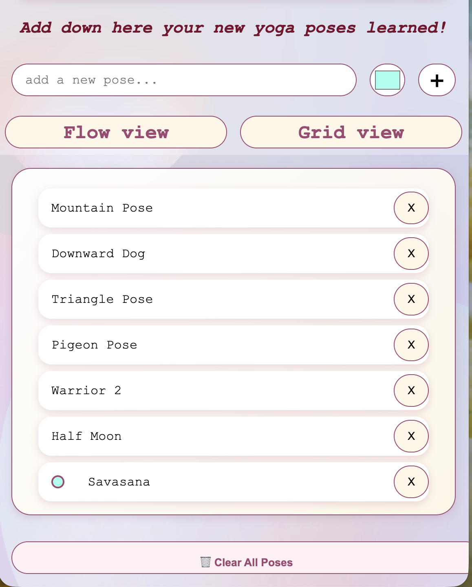
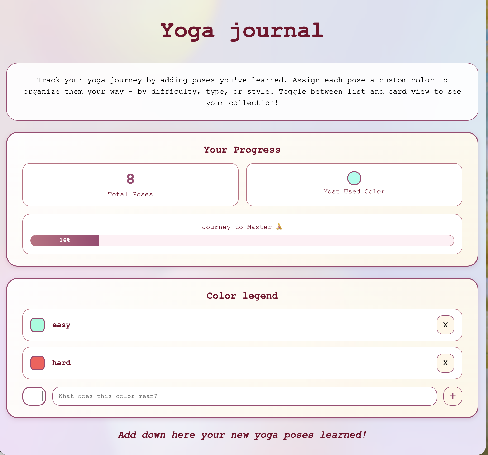
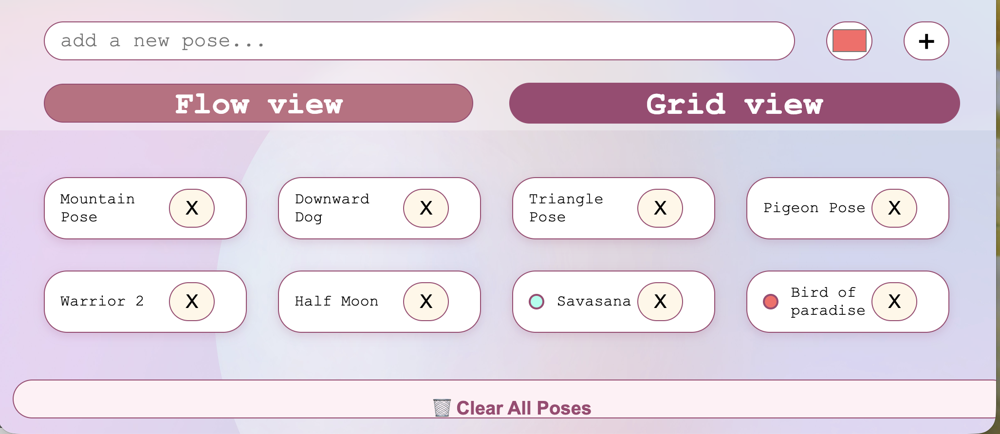

# Assignment 01 

## Brief 

Starting from the concept of a pinboard, implement a web page that:

- is responsive (properly layout for smartphone, tablet, and desktop)
- allows the user to add and remove elements
- allows the user to customize elements (i.e. colors, size)
- allows the switch between two views (at least)

## Project Description

Track and organize your yoga poses with custom color dots for difficulty, type, or style. View your progress, create a color legend, and switch between Flow and Grid views to visualize your journey. Keep practicing to grow your collection!

## List of functions

- Add new poses with custom color dots

- Pick colors to mark difficulty, type, or style

- View progress and most-used color stats

- Switch views between Flow (list) and Grid (card)

- Create a color legend with meanings for each hue

- Remove single poses or clear the entire list with confirmation
