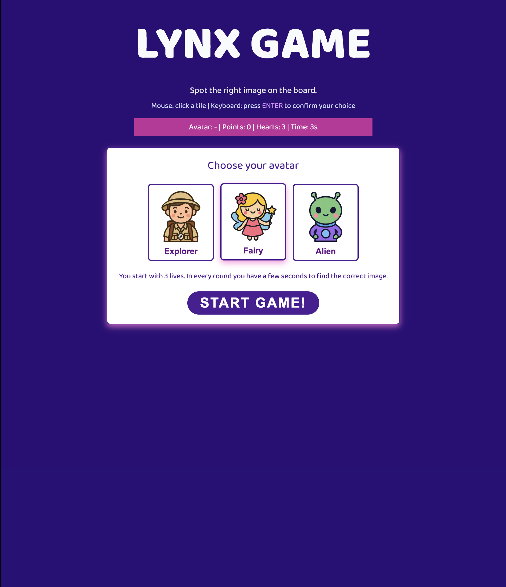
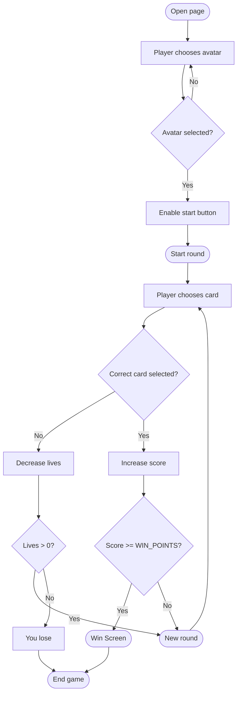

# Lynx Game 

## Brief

Choose a “mini-game” to rebuild with HTML, CSS and JavaScript. The requirements are:
- The webpage should be responsive
- Choose an avatar at the beginning of the game
- Keep track of the score of the player
- Use the keyboard to control the game (indicate what are the controls in the page). You can also use buttons (mouse), but also keyboard.
- Use some multimedia files (audio, video, …)
- Implement an “automatic restart” in the game (that is not done via the refresh of the page)

## Project description

I decided to create this game as it was a favourite of mine when I was little (the board version, of course). 

The game consists on finding the card of the targeted element mentioned on top of the game screen as fast as possible before the timer ends. It's a pretty simple concept, but it's visually tricky. 

You begin selecting one of the three avatars available: the explorer, the fairy and the alien. This avatar will be present during the whole match as a little icon on the score bar to cheer you up. After that, you get in the first round, where you have to choose the right card. If you choose well, you gain points and you move on until you reach a total of 10 points. If you don't choose properly or take too much time, you lose lives. If you lose all three lives, you fail. 

I made the time be very fast, and the cards show the elements in a very similar visual style, so they are not too easy to spot right away. Moreover, I added some movement on the cards, so it confuses the player a bit more and it increases the difficulty. 

I tried to add some more interactions on the keyboard, but honestly don't know how, maybe I'd try more new options with more time :) 

Overall, the game it's pretty simple but quite fun! 

## Screenshots

## Flowchart

## Function list

### avatarButtons.forEach(function (button)

It listens for a click on any avatar button.

Enables the Start game button by setting startButton.disabled = false

### startButton.addEventListener('click')

It listens for a click on the Start game button.

If no avatar is selected, it does nothing
If an avatar is selected, it:

- hides the start screen (startScreen.classList.add('hidden'))
- shows the game screen (gameScreen.classList.remove('hidden'))
- calls startGame() to initialize the match

### backToMenuButton.addEventListener('click')

- It listens for a click on the Back to menu button inside the game screen.

- It stops the timer if it's still running.

- Calls the function goBackToMenu() to reset the game and show the start screen again.

- It stops the background music & resents all the score, lives and time

### endMenuButton.addEventListener('click')

It listens for a click on the Back to menu button inside the end overlay (win/lose popup).
- Hides the end overlay (endOverlay.classList.add('hidden'))
- Calls goBackToMenu() to reset the game and return to the start screen

### document.addEventListener('keydown')

It listens for key presses on the whole page.
If the Enter key is pressed while the game screen is visible, it calls the function confirmSelection() to check the currently selected tile.

### startGame()

It starts a new match.

It resets everything (score, lives, time left) and updates the HUD display (scoreDisplay, livesDisplay, avatarDisplay, timeDisplay)

It also shows a message: “Click a tile, then press ENTER to confirm" and starts the background music from the beginning and calls bgMusic.play(). 

### startRound()

It sets up a single round.
- Resets the selected tile (selectedTile = null)
- Updates the message to: “Pick a tile and then hit ENTER.”
- Calls:
        - pickTargetCard() to choose the target image
        - setRoundTime() to decide how many seconds the player has
        - buildGrid() to create the grid of tiles
        - startTimer() to start the countdown

### setRoundTime()

It sets how much time the player has for the current round, based on the current score:

- If score >= 7 → timeLeft = 3 seconds (hard)

- Else if score >= 3 → timeLeft = 4 seconds (medium)

- Else → timeLeft = BASE_ROUND_SECONDS (easy at the beginning)

Then updates the time shown in the HUD (timeDisplay).

### goBackToMenu()

Parameters: none
Return: none

- Stops the timer if it is running (clearInterval(timerId))
- Pauses the background music (bgMusic.pause())
- Resets the main game state
- Updates the HUD values on screen (score, lives, avatar, time, message)
- Removes the selected class from all avatar buttons
- Disables the Start game button again (startButton.disabled = true)
- Hides the game screen and shows the start screen

### buildGrid()

It builds the 6×5 grid of cards for the current round.

- Clears any previous tiles from the grid (gridElement.innerHTML = "")
- Uses the arrays cardImages and cardLabels to decide which cards to show
- Makes sure:

    - the target card (targetCardIndex) is included in the selected set
    - each card appears at most maxCopiesPerCard times (here 2)
    - Creates a list cardIndices with card indexes for each of the BOARD_SIZE tiles
- Shuffles cardIndices so the target appears in a random position
- For each index:

    - Creates an < img > with the correct src and alt
    - Randomly adds CSS classes like tilt-left, tilt-right, small, big to add visual confusion
    - Randomly adds movement classes card-spin, card-flip or card-shake to some tiles
    - Adds a click listener that calls selectTile(tile) when the tile is clicked
    - Appends the tile to the grid (gridElement.appendChild(tile))

### pickTargetCard()

It randomly chooses which card the player has to find.

Picks a random index: targetCardIndex = Math.floor(Math.random() * cardImages.length)

Updates the target box:

targetImage.src and targetImage.alt from cardImages and cardLabels

targetName.innerHTML with the label of the card

### startTimer()

It starts the countdown for the current round.

- Clears any previous timer (clearInterval(timerId))

- Creates a new interval with setInterval() that:
    - Decreases timeLeft by 1 every second
    - Updates the HUD time (timeDisplay)
    - When timeLeft <= 0, stops the timer and calls handleTimeout()

### handleTimeout()

It is called when the player runs out of time.

Shows the message: “Time's up! You lose one life.”

- Plays the wrong sound (playWrong())

- Calls loseLife() to remove one life and check if the game is over

### selectTile(tile)

Parameters: tile (DOM element),  the < li > tile that was clicked
Return: none

It selects a tile in the grid.
    - Removes the selected class from all tiles in the grid
    - Adds the selected class to the clicked tile
    - Saves the clicked tile in selectedTile for later use in confirmSelection()

### confirmSelection()

It is called when the player presses Enter and checks the chosen tile.

If selectedTile is null, shows message “Choose a tile first” and returns

- Stops the round timer (clearInterval(timerId))

- Reads the card index from the selected tile:
const tileCardIndex = Number(selectedTile.dataset.cardIndex);

- If tileCardIndex === targetCardIndex (correct choice):

- Increases the score (score++) and updates scoreDisplay

- If score >= WIN_POINTS, shows the winning message, plays the correct sound, and calls endGame(true)

- Else plays the correct sound and starts a new round after a short delay (setTimeout(startRound, 800))

If the tile is wrong:
- Shows a message: “Nope, wrong one. You lose a life.”
- Plays the wrong sound and calls loseLife()

### loseLife()

It removes one life and decides if the game continues or ends.
- Decreases lives-- and updates livesDisplay
- If lives <= 0, calls endGame(false) to show the losing screen
- Else, starts a new round after a short delay (setTimeout(startRound, 800))

### endGame(didWin)

Parameters:
didWin (Boolean) — true if the player won, false if they lost
Return: none

It ends the match and shows the overlay.

- Stops the timer (clearInterval(timerId))
- Pauses the background music (bgMusic.pause())
- Updates the overlay text:
    - If didWin is true: “Congrats, you won! Final points: X”
    - Else: “Shame, you lost! Final points: X”

    - Shows the end overlay by removing the hidden class from endOverlay

### playCorrect()

It plays the sound effect for a correct answer.

- Resets the audio position (correctSound.currentTime = 0)

- Calls correctSound.play() and ignores any error if the browser blocks it

### playWrong()

It plays the sound effect for a wrong answer or time-out.

- Resets the audio position (wrongSound.currentTime = 0)
- Calls wrongSound.play() and ignores any error if the browser blocks it

## Content and data sources

Google Fonts - Baloo 

MixKit sounds

Icons made with ChatGPT and some coding advise too but I always try to redo it myself! :) 