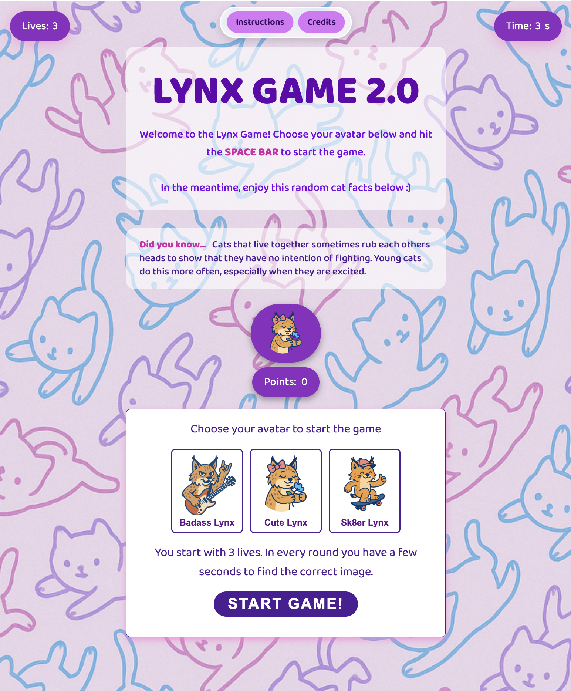
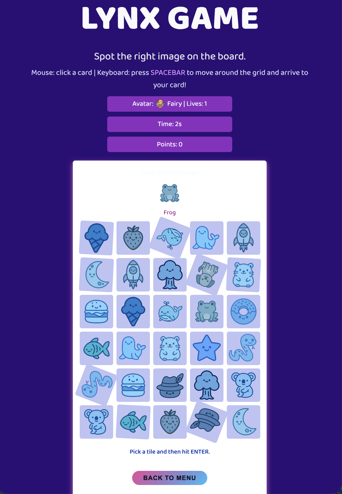
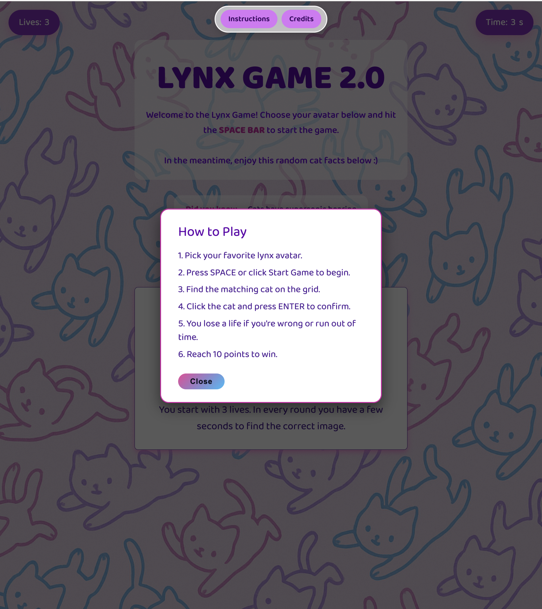
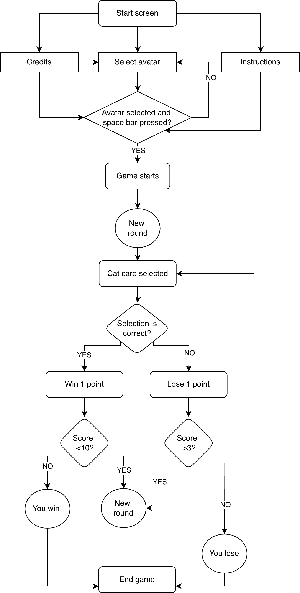

# Brief

Upgrade the **Assignment 02** by adding the use of data coming from an external web API. For example, fetch contents (audio, images, video, text, metadata) from online archives, AI generated contents (chatGPT API), data (weather, realtime traffic data, environmental data).

Have a look at the lesson about the API:

[https://wind-submarine-3d4.notion.site/Lesson-5-200d516637bc811aba69e13b0ffe438f?pvs=74](https://www.notion.so/Lesson-5-200d516637bc811aba69e13b0ffe438f?pvs=21)

The application **must** have those requirements:

- The webpage is responsive
- Use a web API (you choose which one best fists for your project) to load the data and display them in the webpage
- At least one multimedia file (for user feedback interactions, or content itself)
- Develop a navigation system that allows the user to navigate different sections with related content and functionalities

# The Lynx Game 2.0 

Lynx Game is a simple cat-matching game where you choose an avatar and try to find the correct cat in a timed grid. The game uses APIs for images and facts, includes sound feedback, and offers a small navigation system, making the experience interactive and replayable.

# Diagram 

# Main functions

## startGame()

Arguments: none
Description: Initializes a new game: resets score, lives, timer, updates the HUD, and starts the first round.
Returns: nothing.

## startRound()

Arguments: none
Description: Sets the round timer, chooses the target cat, builds the grid, loads a cat fact, and starts the countdown.
Returns: nothing.

## buildGrid(cats)

Arguments: cats (array of cat objects)
Description: Generates the grid of shuffled images, ensuring the target cat appears at least once.
Returns: nothing.

## pickTargetCard()

Arguments: none
Description: Randomly selects the cat image the player must find and updates the target image display.
Returns: nothing.

## selectTile(tile)

Arguments: tile (clicked <li> element)
Description: Highlights the selected tile and saves it as the current user choice.
Returns: nothing.

## confirmSelection()

Arguments: none
Description: Checks whether the selected tile matches the target. Updates score or lives and decides whether to start a new round or end the game.
Returns: nothing.

## loseLife()

Arguments: none
Description: Decreases lives by one, updates the HUD, and checks if the game should end.
Returns: nothing.

## endGame(didWin)

Arguments: didWin (boolean)
Description: Shows the end screen overlay with a win/lose message and the final score.
Returns: nothing.

## goBackToMenu()

Arguments: none
Description: Resets all game values and returns the user to the start screen.
Returns: nothing.

## startTimer()

Arguments: none
Description: Starts the countdown for the active round and handles timeout events.
Returns: nothing.

## loadCatFact()

Arguments: none
Description: Fetches a random cat fact from an external API and displays it in the fact box.
Returns: nothing.

# Content and data sources & API documentation 

1. Cat images: [TheCatApi] (https://thecatapi.com/)
2. Random Cat facts: [catfact.ninja] (https://catfact.ninja/)
3. Audio files: [Mixkit](https://mixkit.co/)
4. Images (background and avatars): created by ChatGPT 

